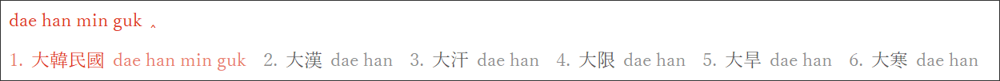
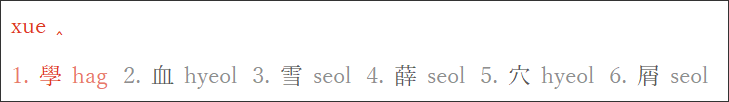
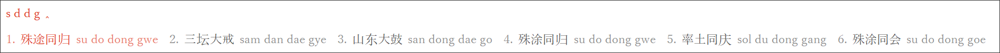

# rime-hanja

_Input Chinese characters by Korean pronunciation_

## Features

(1) Input Chinese characters by Korean pronunciation

(2) Reverse lookup Korean pronunciation by Chinese pinyin

(3) Input Hangeul by romanization

(4) Other features like acronym and Simplified Chinese

## Acknowledgements

* [dbravender/hanja-dictionary](https://github.com/dbravender/hanja-dictionary)
* [osori/korean-romanizer](https://github.com/osori/korean-romanizer)
* [biopolyhedron/rime-qyeyshanglr-hanja](https://github.com/biopolyhedron/rime-qyeyshanglr-hanja)
